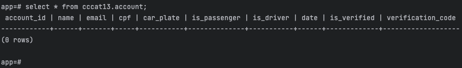

= Clean-code-foundation

This project aims to reflect the project used by Rodrigo Branas but implementing with Kotlin and Vert.x + Coroutines

https://github.com/rodrigobranas/cccat13_1/tree/master[Here] you can find the code for the first class written in Javascript + Express


image:https://img.shields.io/badge/vert.x-4.4.5-purple.svg[link="https://vertx.io"]

This application was generated using http://start.vertx.io

== Building

To launch your tests:
```
./gradlew clean test
```

To package your application:
```
./gradlew clean assemble
```

To run your application:
```
./gradlew clean run
```

== Database setup
To setup your database, using docker-compose, execute in the project root folder:

To bring up the database and run the create.sql inside db/migrations folder:
```
docker-compose up -d
```

To verify that tables were created

Access the Container's Shell - First, you need to access the shell of the PostgreSQL container. Open a terminal and run
```
docker exec -it <container_id> /bin/bash
```
Replace <container_id> with the actual ID or name of your PostgreSQL container

The shortcut command above will list container-id that the name matches "postgres"
```
docker ps -aq --filter "name=postgres"
```

Access the Database - Once inside the container, you can access the PostgreSQL database using the psql command. Run:
```
psql -U postgres -d app
```

And finally, check the table was created:
```
select * from cccat.account;
```

The result should be like that:




== Help
#Vert.x documentation#

* https://vertx.io/docs/[Vert.x Documentation]
* https://stackoverflow.com/questions/tagged/vert.x?sort=newest&pageSize=15[Vert.x Stack Overflow]
* https://groups.google.com/forum/?fromgroups#!forum/vertx[Vert.x User Group]
* https://discord.gg/6ry7aqPWXy[Vert.x Discord]
* https://gitter.im/eclipse-vertx/vertx-users[Vert.x Gitter]
